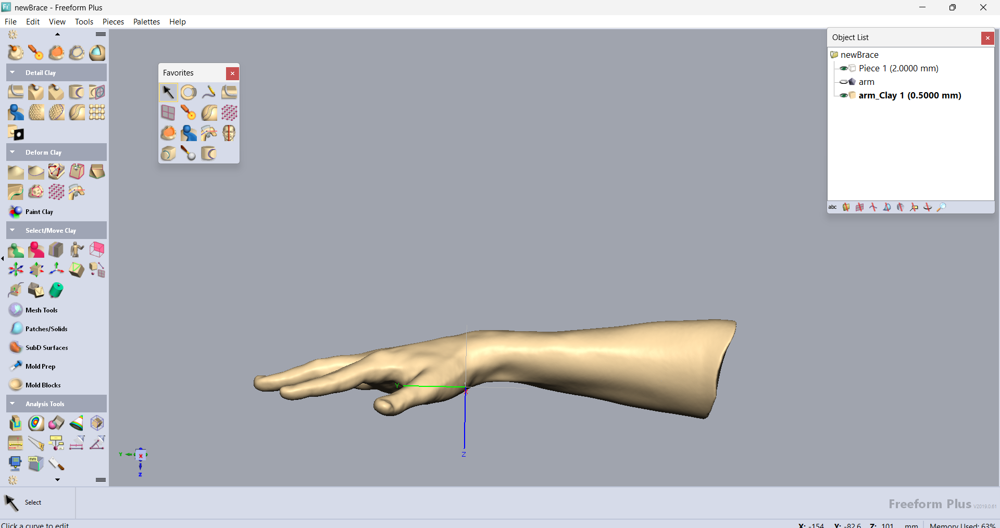
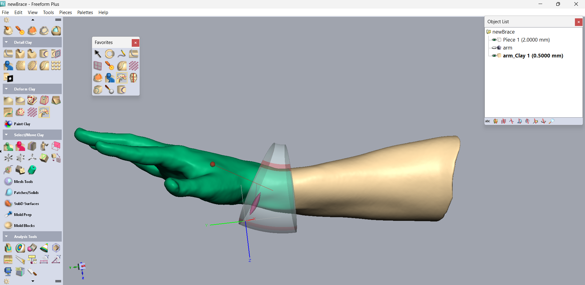
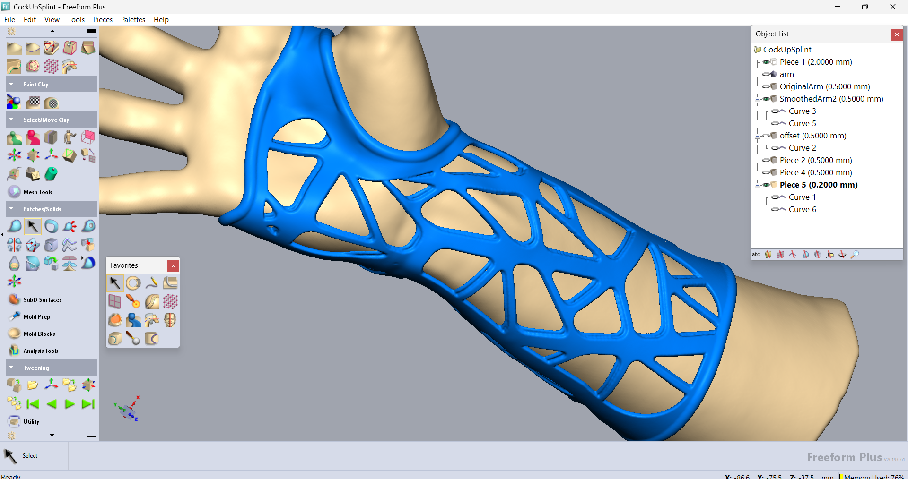
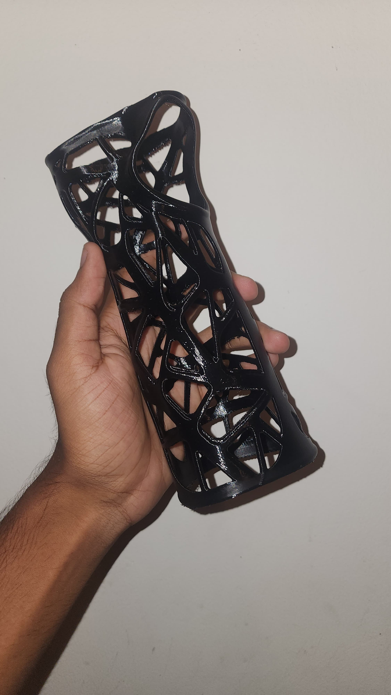

# 🖐️ 3D-Printed Wrist Cock-Up Splint  
Custom-designed using Geomagic Freeform + Haptic Device

---

## 📌 Overview  
This project features a **wrist cock-up splint** designed for a patient with **radial nerve palsy (wrist drop)**. Using **Geomagic Freeform** and a **haptic device**, I sculpted a splint that holds the wrist in approximately **25° extension** — promoting function, reducing strain, and allowing finger mobility.

The splint was printed using **PETG** for strength, flexibility, and patient comfort.

---

## 🎥 Design Process Video  
📽️ *Watch the complete design workflow in Geomagic Freeform:*  

---

## 🧰 Tools & Materials  
- **Modeling Software:** Geomagic Freeform 2019  
- **Hardware:** 3D Systems Haptic Device  
- **Printing Method:** FDM  
- **Material:** PETG  
- **Layer Height:** 0.2 mm  

---

## ✨ Key Features  
- ✅ **~25° wrist extension** to aid wrist drop support  
- ✅ Avoids pressure zones: ulnar styloid, palmar crease, and thumb webspace  
- ✅ Contoured fit along palm arch, wrist, and forearm  
- ✅ Lightweight structure with **ventilation holes**  
- ✅ **Smooth inner surface** for comfort and extended wear  

---

## 🖼️ Image Gallery  

### 🔄 Before & After Hand Positioning  
| Neutral Wrist | 25° Extended Wrist |
|---------------|--------------------|
|  |  |

---

### 🧊 Final Splint Design in Geomagic Freeform  

---

### 🛠️ Final 3D Printed Splint  
| Front View | Side View |
|------------|-----------|
|  |  |

